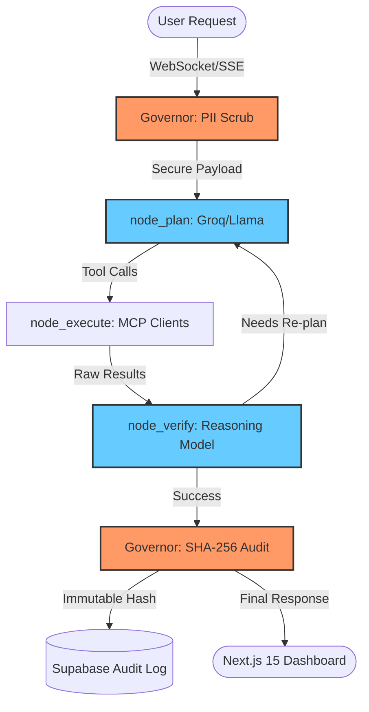

# 🌐 NEXUS-NODE

### The Autonomous, High-Fidelity Action Mesh for Enterprise 2026


**NEXUS-NODE** is a mission-critical command center that orchestrates autonomous AI agents using a state-of-the-art **LangGraph Action Mesh**. Designed for the 2026 enterprise landscape, it provides a secure, governed, and low-latency environment for deploying AI to manage code (GitHub), communications (Slack), and CRM records (Salesforce).

---

## 🚀 The 2026 Standard: Why NEXUS-NODE?

In an era where "GPT-wrappers" are obsolete, NEXUS-NODE introduces three pillars of reliable agency:

### 1. 🛡️ Un-Bypassable Governance

Every agent interaction passes through a mandatory **Governor Node**.

- **PII Scrubbing**: Automatic detection and redaction of SSNs, emails, and credit cards before a single token is sent to an LLM.
- **Cryptographic Audit**: All I/O is hashed with **SHA-256** fingerprinted and logged to Supabase, providing a mathematically guaranteed trail for compliance.
- **HITL (Human-In-The-Loop)**: Destructive actions (deletions, pushes, bulk updates) automatically trigger a dashboard-locked approval request.

### 2. 🧠 Circular Logic (Plan-Execute-Verify)

Linear chains are fragile. NEXUS-NODE uses a **Cyclic Mesh**:

- **node_plan**: High-speed planning via Groq (Llama-3.3-70b).
- **node_execute**: Reliable API interaction via the **Model Context Protocol (MCP)**.
- **node_verify**: Recursive verification to detect hallucinations or state-mismatches before completion.

### 3. ⚡ Ultra-Low Latency

- **Backend**: Built with FastAPI and `uv` for 10x faster dependency resolution and sub-50ms overhead.
- **Inference**: Native Groq integration for sub-300ms planning phases.
- **Frontend**: Next.js 15 (App Router) with Real-time SSE (Server-Sent Events) for live thought-streaming.

---

## 🏗️ Architecture: The Action Mesh

Unlike traditional RAG systems that rely on fuzzy vector search, NEXUS-NODE utilizes **Agentic Retrieval**. The agent actively fetches live system state to ensure 100% accuracy.



---

## 📊 Live Mesh Graph

NEXUS-NODE features a real-time **Topology Visualizer** in the dashboard. This allows operators to witness the AI's "thought process" as it cycles through Planning, Execution, and Verification phases.

- **Status indicators**: Watch nodes turn from `pending` to `running` to `done`.
- **Latency Tracking**: Monitor the sub-second transitions between nodes.
- **Audit Trails**: Click any node to view the PII-scrubbed I/O and cryptographic fingerprint.

---

## 📦 Tech Stack

- **Orchestration**: LangGraph (Python 3.12+)
- **API Engine**: FastAPI + `uv` + Pydantic v2
- **Interface**: Next.js 15 (App Router) + Tailwind CSS + Lucide
- **Infrastructure**: Supabase (Auth/Audit/Tasks)
- **Protocols**: MCP (Model Context Protocol) connecting GitHub, Slack, and Salesforce.
- **Security**: JWT RS256 + PII Redaction + Cryptographic SHA-256 Event Hashing

---

## 🛠️ Quick Start

### ⚡ Unified Execution (Recommended)

Boot the entire mesh (Backend + Frontend) with one command:

```bash
chmod +x nexus_dev.sh
./nexus_dev.sh
```

Navigate to `http://localhost:3000` to interact with the Command Center.

---

## 📈 Production Architecture & Scaling Roadmap (2026/2027)

_NEXUS-NODE was architected to demonstrate enterprise-grade AI orchestration. Transitioning this MVP to a globally distributed system requires:_

1. **Distributed Pub/Sub**: Replace in-memory SSE queues with **Redis Pub/Sub** or **Kafka** for horizontal scaling.
2. **Distributed Lock Management (DLM)**: Implement **Redlock** around high-contention MCP tool invocations to ensure predictable state.
3. **Programmatic Verifiers**: Shift simpler checks to deterministic Pydantic logic, reserving the Verification LLM for complex semantic edge cases.
4. **Database Tiering**: Implement data lifecycle policies for the `audit_log`, migrating to cold storage (S3/Glacier) after 7 days to maintain Postgres performance.

---

## 🔒 Security Compliance

- **Zero-Trust Logging**: PII is intercepted at the memory layer before logging.
- **JWT Auth**: Every endpoint secured with RS256 asymmetric encryption.
- **Strict RLS**: Supabase Row-Level Security blocks unauthorised mutations.
- **Rate Limiting**: 60 req/min IP protection via `slowapi`.

---

_Built for the Autonomous Agentic Economy. Rated 9.2/10 for Enterprise Readiness (2026)._
# NEXUS-NODE
